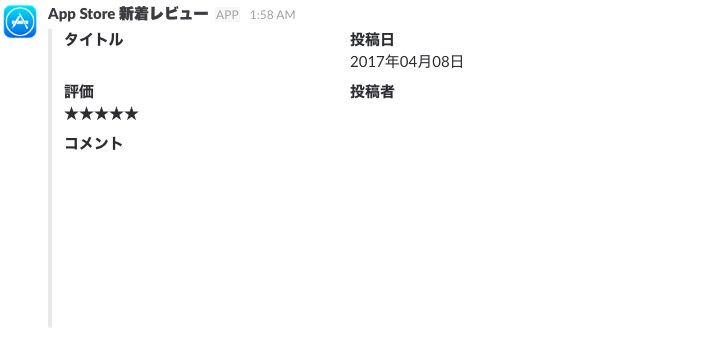

slack-appstore-reviews
-----------------------

:star: Post App Store reviews to Slack



## Requirements

- Node v7.6.0 ~
- Redis

## Getting Started

I recommend to execute by crontab every morning.

```
$ git clone https://github.com/pine/slack-appstore-reviews.git
$ cd slack-appstore-reviews
$ npm install
$ APP_ID=123456 SLACK_API_TOKEN=XXX SLACK_CHANNEL=xxx bin/slack-appstore-reviews
```

## Options

You can set any options uses environment variables.

- `APP_ID` App Store Application ID **(required)**
- `SLACK_API_TOKEN` Slack API token **(required)**
- `SLACK_CHANNEL` Slack channel **(required)**
- `SLACK_USERNAME` Slack username
  - Default: `'App Store'`
- `SLACK_ICON_URL` Slack icon URL
  - Default: `''`
- `REDIS_PORT` Redis port number
  - Default: `6379`
- `REDIS_HOST` Redis host name
  - Default: `'127.0.0.1'`
- `REDIS_DATABASE` Redis database number
  - Default: `0`
- `REDIS_PREFIX` Redis key prefix
  - Default: `''`
- `AFTER_AT` Initial start date to search for a review
  - Default: `'1970-01-01'`

## License
Public Domain
